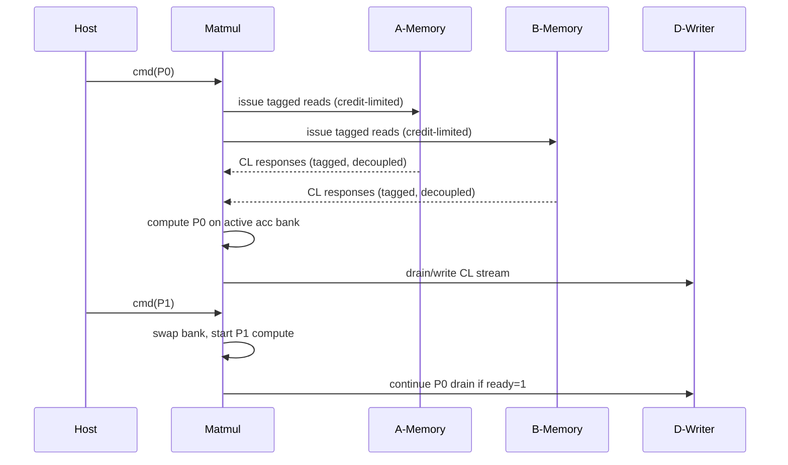

# Systolic FP32 Matmul - Architecture Specification

**Version:** 1.2-draft
**Date:** 2026-02-22

## 1. Executive Summary

This document is the unified architecture spec for the command-driven FP32 systolic matrix
multiplier implemented in this repository. It combines strict interface/verification contracts
with implementation-oriented guidance for the current staged-tile + inject/drain pipeline.

The unit computes:

`D = A x B`

with no `C` accumulation input in v1. The design targets sustained compute with overlapped
primitive execution and cacheline-wide memory interfaces.

Primary performance goals:

- Up to `MAX_OUTSTANDING_RD` (default 16) outstanding reads on each input interface (`A`, `B`)
- No unnecessary bubbles between consecutive primitive contexts
- Peak `D` output stream capability of `1 cacheline / cycle` when downstream is ready

## 2. Goals and Non-Goals

### 2.1 Goals

- Implement FP32 matrix multiply using an output-stationary systolic architecture.
- Define complete, port-level protocol contracts for command, memory, output, and status.
- Support cacheline-wide transfers on all data interfaces.
- Decouple read request and response channels for `A` and `B`.
- Allow up to `MAX_OUTSTANDING_RD` (default 16) in-flight reads per input interface.
- Support downstream backpressure on `D` output.
- Overlap primitive drain of context N with compute of context N+1.

### 2.2 Non-Goals (v1)

- No `C` input; no `D = C + A x B` mode.
- No sparse or quantized formats (FP32 only).
- No partial-line writes; all writes are full cacheline writes.
- No non-aligned edge fragments inside hardware (software must pad to valid granularities).

## 3. Terminology and Parameters

### 3.1 Terminology

- `CL`: cacheline
- `E`: FP32 elements per cacheline (`CL_BITS / 32`)
- `S`: physical systolic dimension (`S = E`, default 4 in this repo)
- `Primitive`: command-level tiled matmul work unit
- `Micro-tile`: one physical `S x S` output tile computed by the array
- `PE`: processing element (FP32 MAC + dual accumulator banks)

### 3.2 Compile-Time Parameters

| Parameter | Default | Description |
|---|---:|---|
| `ADDR_BITS` | 64 | Address width for all memory interfaces |
| `CL_BITS` | 128 | Cacheline width (must be multiple of 32) |
| `FP_BITS` | 32 | FP element width |
| `MAX_OUTSTANDING_RD` | 16 | Max in-flight reads per input interface (must be power of 2) |
| `CMDQ_DEPTH` | 4 | Command queue depth |
| `OUT_FIFO_DEPTH_CL` | 32 | Output elastic buffer depth in CLs |
| `STAGED_TILE_DEPTH` | 8 | Depth of staged A/B tile ring between prefetch and inject |
| `L_MUL` | 4 | FP32 multiplier pipeline depth (implementation target) |
| `L_ADD` | 4 | FP32 adder pipeline depth (implementation target) |

Derived:

- `CL_BYTES = CL_BITS / 8`
- `CL_ELEMS = CL_BITS / FP_BITS`
- `S = CL_ELEMS`
- `TAG_BITS = log2(MAX_OUTSTANDING_RD)` (exact, since `MAX_OUTSTANDING_RD` is power of 2)

Tag space equals `MAX_OUTSTANDING_RD`. Each tag maps 1:1 to a reorder-buffer slot, so no
free-list is needed — tags are allocated sequentially and retired in-order by the reorder buffer.

For default `CL_BITS = 128`, `CL_ELEMS = S = 4` and one cacheline carries one 4-element FP32 row.
The same architecture is also validated at `CL_BITS = 512` (`S = 16`) in regression/perf tests.

## 4. Supported Primitive Sizes and Command Constraints

### 4.1 Required Primitive Sizes

Let `E = CL_ELEMS`.

- Supported `prim_m`: `{E, 2E, 4E, 8E}`
- Supported `prim_n`: `{E, 2E, 4E, 8E}`
- Supported `prim_k`: `{E, 2E, 4E, 8E, 16E}`

For current repo default `E = 4`:

- `prim_m`, `prim_n` in `{4, 8, 16, 32}`
- `prim_k` in `{4, 8, 16, 32, 64}`

For `E = 16` (full-size mode):

- `prim_m`, `prim_n` in `{16, 32, 64, 128}`
- `prim_k` in `{16, 32, 64, 128, 256}`

### 4.2 Command Constraints

- `M`, `N`, `K` are positive.
- `M`, `N`, `K` are integer multiples of `E`.
- `M` divisible by `prim_m`; `N` divisible by `prim_n`; `K` divisible by `prim_k`.
- `lda >= K`, `ldb >= N`, `ldd >= N` (all in elements).
- `A`, `B`, and `D` base addresses are `CL_BYTES` aligned.

### 4.3 Primitive-to-Physical Mapping

The physical array computes one `S x S` micro-tile at a time. A command primitive larger than
`S x S` is decomposed into a deterministic sequence of micro-tiles. Micro-tile order is row-major
in `(mi, nj)` for predictable `D` write addresses.

## 5. External Interface Specification

### 5.1 Global

| Port | Dir | Width | Description |
|---|---|---:|---|
| `clk` | in | 1 | Clock |
| `reset` | in | 1 | Active-high synchronous reset |

### 5.2 Command Descriptor Input (Decoupled)

| Port | Dir | Width | Description |
|---|---|---:|---|
| `cmd_valid` | in | 1 | Descriptor valid |
| `cmd_ready` | out | 1 | Descriptor accept |
| `cmd_desc_cmd_id` | in | 16 | Software-visible command ID |
| `cmd_desc_a_base` | in | `ADDR_BITS` | A base address |
| `cmd_desc_b_base` | in | `ADDR_BITS` | B base address |
| `cmd_desc_d_base` | in | `ADDR_BITS` | D base address |
| `cmd_desc_m` | in | 16 | Rows of A / D |
| `cmd_desc_n` | in | 16 | Cols of B / D |
| `cmd_desc_k` | in | 16 | Shared reduction dimension |
| `cmd_desc_lda` | in | 16 | A leading dimension (elements) |
| `cmd_desc_ldb` | in | 16 | B leading dimension (elements) |
| `cmd_desc_ldd` | in | 16 | D leading dimension (elements) |
| `cmd_desc_prim_m` | in | 16 | Primitive M |
| `cmd_desc_prim_n` | in | 16 | Primitive N |
| `cmd_desc_prim_k` | in | 16 | Primitive K |
| `cmd_desc_flags` | in | 8 | Must be zero in v1 |

### 5.3 A Read Request Channel

| Port | Dir | Width | Description |
|---|---|---:|---|
| `a_rd_req_valid` | out | 1 | Read request valid |
| `a_rd_req_ready` | in | 1 | Read request accept |
| `a_rd_req_addr` | out | `ADDR_BITS` | CL-aligned address |
| `a_rd_req_tag` | out | `TAG_BITS` | Request tag |

### 5.4 A Read Response Channel

| Port | Dir | Width | Description |
|---|---|---:|---|
| `a_rd_rsp_valid` | in | 1 | Response valid |
| `a_rd_rsp_ready` | out | 1 | Response accept |
| `a_rd_rsp_data` | in | `CL_BITS` | Response data |
| `a_rd_rsp_tag` | in | `TAG_BITS` | Response tag |
| `a_rd_rsp_err` | in | 1 | Error indication |

### 5.5 B Read Request Channel

| Port | Dir | Width | Description |
|---|---|---:|---|
| `b_rd_req_valid` | out | 1 | Read request valid |
| `b_rd_req_ready` | in | 1 | Read request accept |
| `b_rd_req_addr` | out | `ADDR_BITS` | CL-aligned address |
| `b_rd_req_tag` | out | `TAG_BITS` | Request tag |

### 5.6 B Read Response Channel

| Port | Dir | Width | Description |
|---|---|---:|---|
| `b_rd_rsp_valid` | in | 1 | Response valid |
| `b_rd_rsp_ready` | out | 1 | Response accept |
| `b_rd_rsp_data` | in | `CL_BITS` | Response data |
| `b_rd_rsp_tag` | in | `TAG_BITS` | Response tag |
| `b_rd_rsp_err` | in | 1 | Error indication |

### 5.7 D Write Output Channel (Backpressure-Capable)

| Port | Dir | Width | Description |
|---|---|---:|---|
| `d_wr_valid` | out | 1 | Write beat valid |
| `d_wr_ready` | in | 1 | Downstream ready |
| `d_wr_addr` | out | `ADDR_BITS` | CL-aligned destination address |
| `d_wr_data` | out | `CL_BITS` | Output cacheline data |
| `d_wr_last` | out | 1 | Last beat for current command |
| `d_wr_cmd_id` | out | 16 | Command ID tag |

All D writes are full-cacheline writes (no byte strobes). If integration requires a strobe
signal, the wrapper must tie it to all-ones.

### 5.8 Completion / Status Channel

| Port | Dir | Width | Description |
|---|---|---:|---|
| `sts_valid` | out | 1 | Status valid |
| `sts_ready` | in | 1 | Status accept |
| `sts_cmd_id` | out | 16 | Completed command ID |
| `sts_ok` | out | 1 | `1=success`, `0=error` |
| `sts_err_code` | out | 8 | Error code when `sts_ok=0` |

## 6. Data Layout, Addressing, and Math

### 6.1 Math Definition

`D[m,n] = sum_{k=0..K-1}(A[m,k] * B[k,n])`

- FP32 multiply-accumulate datapath
- No `C` input in v1
- Accumulator state is zero-initialized at primitive start

### 6.2 FP32 Rounding and Special Values

- Rounding mode: round-to-nearest-even (IEEE 754 default).
- NaN propagation: if any input is NaN, the result is NaN (quiet NaN preferred).
- Inf arithmetic: follows IEEE 754 rules (Inf * 0 = NaN, Inf + Inf = Inf, etc.).
- Denormals: flush-to-zero on both input and output (FTZ/DAZ). This simplifies the datapath
  and is standard practice for hardware MAC arrays.

### 6.3 Layout and Addressing

- Row-major matrices in memory
- FP32 elements are 4 bytes
- Every memory beat is exactly one full cacheline

Address equations (bytes):

- `addr_A(m,k) = a_base + 4 * (m * lda + k)`
- `addr_B(k,n) = b_base + 4 * (k * ldb + n)`
- `addr_D(m,n) = d_base + 4 * (m * ldd + n)`

All generated request/write addresses are `CL_BYTES` aligned and represent full-line accesses.

Internal address arithmetic (`m * lda`, `k * ldb`, etc.) must be computed at `ADDR_BITS` width
to avoid overflow. The 16-bit dimension/stride fields on the command interface represent element
counts; the address generators widen them before multiplication.

## 7. Architecture Overview

### 7.1 Component and Boundary View (ASCII)

```text
cmd_* --> CmdFrontend --> cmdDispatchQ --> TileScheduler --> stepIssueQ
                                                           |
                                                           v
                     +---------------------------------------------------+
                     | Prefetch Engine (top-level FSM)                   |
                     | - config/start ReadEngine A/B                     |
                     | - load staged A/B tile ring buffers               |
                     | - enqueue inject context/slot/sequence            |
                     +-------------------------+-------------------------+
                                               |
a_rd_* <------> ReadEngine A (tags + reorder)  |  ReadEngine B (tags + reorder) <------> b_rd_*
                                               v
                              injectQ + injectSlotQ + injectSeqQ
                                               |
                                               v
                     +---------------------------------------------------+
                     | Inject Engine + hazard scoreboard                 |
                     | - FEED S cycles into SystolicCore                |
                     | - bank ownership / conflict gating               |
                     +-------------------------+-------------------------+
                                               |
                                               v
                                A/B skew -> SystolicCore (SxS PEs)
                                               |
                                               v
                                    drainQ + drainDelayQ
                                               |
                                               v
                     +---------------------------------------------------+
                     | Drain Engine + DrainPacker                        |
                     | - tail-delay aware drain start                    |
                     | - in-module RMW K-reduction buffer               |
                     | - flush to outFifo                               |
                     +-------------------------+-------------------------+
                                               |
                                               v
                                            outFifo --> d_wr_*

status:
  command accept + drain/write completion + poison/error
    --> in-order commit queue --> sts_*
```

This split keeps command, memory, compute, and output decoupled so variable memory latency and
downstream write stalls do not immediately bubble the FEED path.

Implementation note:
- In the current repository revision, prefetch/inject/drain engines are implemented directly in
  `SystolicMatmul.scala`. Decomposed controller modules under `src/matmul/controllers/` are
  maintained as reference structure but are not the active top-level control path.

### 7.2 Behavior View (Mermaid)



This sequence captures required overlap: primitive `P1` begins while `P0` is draining.

## 8. Detailed Micro-Architecture

### 8.1 Command Frontend and Validation

- Accept descriptors via `cmd_valid/cmd_ready` and enqueue in `CMDQ`.
- Validate dimensions, strides, primitive sizes, and address alignment.
- Reject invalid descriptors with terminal error status.
- For valid descriptors, scheduler consumes commands in-order.

### 8.2 Tile Scheduler and Iteration Order

Scheduler decomposes each command into primitives, then into physical micro-tiles.

Command-level loop (iterates over primitives):

```text
for pi in 0 .. (M / prim_m) - 1:
  for pj in 0 .. (N / prim_n) - 1:
    for pk_cmd in 0 .. (K / prim_k) - 1:
      execute_primitive(pi, pj, pk_cmd)
```

Within each primitive, micro-tile decomposition:

```text
for mi in 0 .. (prim_m / S) - 1:
  for nj in 0 .. (prim_n / S) - 1:
    clear(active_bank)
    for pk in 0 .. (prim_k / S) - 1:
      fetch_A_B(mi, nj, pk)
      feed_systolic(mi, nj, pk)
    bank_swap_and_drain(mi, nj)
```

**K-reduction across primitives:** When `K > prim_k`, multiple primitives contribute partial
sums to the same output tile. Since each primitive zero-initializes its accumulator, the partial
`D` results must be summed. The drain stage handles this in `DrainPacker`: for `pk_cmd > 0`,
it reads the prior partial line from an internal D-buffer (`dBuffer`), performs FP32 lane-wise
add with the newly drained line, and writes the merged line back. The first primitive for a
given `(pi, pj)` writes directly. No additional external read interface is required.

Command-level primitive order is row-major in `(pi, pj)` with `pk_cmd` innermost, ensuring all
partial K-contributions for a given output tile complete before moving to the next tile.

### 8.3 A/B Read Engines (Tagged, Decoupled)

- One independent engine per interface (`A`, `B`).
- Each engine contains:
  - outstanding request counter (`<= MAX_OUTSTANDING_RD`)
  - `MAX_OUTSTANDING_RD`-entry reorder buffer (one CL slot per tag)
  - head/tail tag counters for sequential allocation and in-order retirement
- Tag allocation: tags are assigned sequentially (mod `MAX_OUTSTANDING_RD`). The next tag is
  allocated on request issue; the reorder buffer retires entries in allocation order, restoring
  in-order CL delivery to downstream consumers regardless of response arrival order.
- Requests are issued when:
  - `*_rd_req_ready = 1`
  - credits available (outstanding < `MAX_OUTSTANDING_RD`)
  - reorder buffer has a free slot
- Responses arrive out-of-order and are written to the reorder buffer slot indexed by tag.
- The reorder buffer head drains in-order into the staged tile buffers.
- Any `*_rd_rsp_err` triggers command failure handling.

### 8.4 Staged A/B Tile Buffers (Current Implementation)

The top-level keeps a deep ring of staged tile slots (`STAGED_TILE_DEPTH`) shared by A and B.
Each slot corresponds to one micro-tile context queued for FEED.

- `A` load: `S` cachelines are read and unpacked into `aStageTiles(slot)(row)(elem)`.
- `B` load: `S` cachelines are read into `bStageTiles(slot)(rowCL)`.
- Producer/consumer pointers for A and B are kept lockstep, with sequence assertions to prevent
  slot mismatch or out-of-order consume.
- A/B tiles are staged by the prefetch engine and consumed by the inject engine through
  `injectQ`, `injectSlotQ`, and `injectSeqQ`.

Column-time A feed is produced directly from staged storage during inject:
- cycle `k`: `aIn(i) = aStageTiles(slot)(i)(k)` and `bIn(j) = bStageTiles(slot)(k)(j)`.

This realizes the transpose behavior without a standalone `TransposeBuffer` module in the active
top-level datapath.

### 8.5 Inject/Prefetch/Drain Control Split

Control is implemented as three cooperating engines in `SystolicMatmul`:

- Prefetch engine:
  - pops step contexts,
  - runs A/B reads and staged-tile fill,
  - enqueues inject contexts.
- Inject engine:
  - drains staged contexts into `S` FEED cycles,
  - enforces bank hazard ownership checks,
  - optionally chains directly into next FEED to reduce bubbles.
- Drain engine:
  - decoupled via `drainQ` and `drainDelayQ`,
  - waits `drainTailDelay = 2*(S-1) + L_MUL + L_ADD + 1`,
  - requests drain/flush from `DrainPacker`.

### 8.6 Skew Networks

Skew aligns operands so PE(i,j) sees matching reduction index `k` simultaneously.

- A skew (west edge): row `i` delayed by `i` cycles.
- B skew (north edge): column `j` delayed by `j` cycles.
- Valid sideband propagates with data to gate MAC updates.

Alignment rule:

- PE(i,j) receives `A[i][k]` and `B[k][j]` at time `t = k + i + j`.

### 8.7 Systolic Core and PE Behavior

- Physical core is `S x S` PEs (`4 x 4` at repo default, `16 x 16` in full-size mode).
- Horizontal `A` and vertical `B` forwarding each incur one registered hop.
- Each PE contains:
  - FP32 multiply pipeline (`L_MUL`)
  - FP32 add/accumulate pipeline (`L_ADD`)
  - dual accumulator banks (`bank0`, `bank1`)
- One bank is active for accumulation while the other is available for drain.

### 8.8 Skew Drain Tail and Accumulation Timing

After the last A/B values are injected into the skew networks for a micro-tile of reduction
depth `prim_k / S` steps, the systolic array requires an additional `2*(S-1)` cycles for all
PEs to complete their final MAC operations (skew pipeline drain). The accumulator bank for
this micro-tile is not ready for drain until this tail completes.

- Inject phase: `prim_k / S` cycles (one column of A / one row of B per cycle).
- Tail phase: `2*(S-1)` cycles after last inject.
- Drain can begin on the cycle after the tail completes.

### 8.9 Primitive Overlap and No-Bubble Contract

Required no-bubble condition between micro-tile contexts:

- If `d_wr_ready=1` and the next staged A/B context is available, the inject phase of micro-tile
  `T(n+1)` starts no later than the cycle after the final inject cycle of micro-tile `T(n)`.
- The skew tail of `T(n)` overlaps with the inject phase of `T(n+1)` — they use different
  accumulator banks, so no conflict occurs.

Bank exclusivity rule:

- `drain_bank != active_accumulate_bank` at all times.
- Bank swap occurs after the tail phase completes and drain of the previous bank has finished.

### 8.10 Drain, Output Packer, and Backpressure

- `DrainPacker` drains one row per cycle from the inactive bank and packs `S` FP32 values into
  one `CL_BITS` beat.
- For `pk_cmd > 0`, drained lines are merged with prior partials via internal D-buffer RMW.
- Flush phase streams packed lines through `outFifo` to `d_wr_*`.
- Drain/output can sustain `1 CL/cycle` in flush windows when `d_wr_ready=1`.
- `OUT_FIFO_DEPTH_CL` absorbs temporary downstream stalls; prolonged stalls backpressure flush
  and are attributed by utilization counters.

## 9. Timing and Throughput Contract

### 9.1 Throughput Targets

- Peak `D` stream during drain windows: `1 CL/cycle` with `d_wr_ready=1`.
- A/B request issue capability: up to `1 req/cycle` per interface while credits and buffering allow.
- Read concurrency: up to `MAX_OUTSTANDING_RD` in-flight per interface.

### 9.2 Forward-Progress Conditions

Under these conditions:

- `d_wr_ready` remains asserted often enough to avoid permanent output blockage
- memory returns enough A/B responses to keep staged contexts available to inject
- no protocol errors are observed

the unit shall:

- make forward progress without deadlock
- keep core input injection continuous across primitive boundaries (no unnecessary bubbles)
- maintain in-order command completion on `sts_*`

### 9.3 Latency Notes (Informative)

First-result latency depends on memory latency, `K`, and implementation pipeline depths.
No fixed absolute-cycle guarantee is required in v1; only the throughput and overlap
contracts above are normative.

## 10. Error Handling and Recovery

### 10.1 Error Conditions

- Unsupported primitive size
- Invalid dimension/stride/alignment
- Read response error (`a_rd_rsp_err` or `b_rd_rsp_err`)
- Tag protocol violation (unknown tag, duplicate completion, credit underflow/overflow)
- Internal FIFO overflow/underflow protection event

### 10.2 Required Behavior

- Stop accepting new commands while handling an active error (`cmd_ready` deasserted).
- Safely quiesce or flush the failed command's in-flight contexts.
- Emit exactly one terminal status for the failed command (`sts_ok=0`, non-zero `sts_err_code`).
- Commands already enqueued behind the failed command are discarded and each receives its own
  error status (`sts_ok=0`). The unit does not silently drop commands.
- Return to idle-ready state after all pending statuses have been delivered.

## 11. Verification Requirements

### 11.1 Interface and Protocol

- Valid/ready compliance on all decoupled interfaces.
- Outstanding bounds:
  - `0 <= outstanding_A <= MAX_OUTSTANDING_RD`
  - `0 <= outstanding_B <= MAX_OUTSTANDING_RD`
- Address alignment checks for all read/write beats.
- Tag checks: no unknown response tag, no tag reuse before completion.

### 11.2 Functional Correctness

- Compare `D` versus software FP32 reference matmul (using matching FTZ/DAZ rounding).
- Directed tests for all supported `prim_m/n/k` sizes.
- Multi-primitive command tests over full `(M,N,K)` iteration.
- K-reduction test: `K > prim_k` confirming read-modify-write accumulation is correct.
- Explicit test confirming no `C` contribution (`D = A x B` only).
- Reorder buffer test: responses arriving in reversed/random order produce correct results.

### 11.3 Concurrency and Performance

- Random memory latency with out-of-order tagged responses.
- `d_wr_ready` backpressure stress with no data loss or reordering.
- Primitive overlap test proving no unnecessary bubbles between contexts.
- Throughput test demonstrating sustained `1 CL/cycle` drain when sink is ready.

### 11.4 Assertions and Coverage

- Assertions:
  - no FIFO overflow/underflow
  - bank exclusivity (`drain_bank != active_bank`)
  - tag scoreboard consistency
- Coverage:
  - outstanding depth reaches `MAX_OUTSTANDING_RD` on both `A` and `B`
  - overlap path exercised
  - backpressure stall and resume exercised
  - error recovery path exercised

## 12. Architectural Fit Assessment

- Clean fit with current architecture: **Yes**.
- This spec keeps clean module boundaries (`command`, `memory`, `compute`, `output/status`) and
  avoids single-FSM entanglement.
- Avoided workaround: requiring strictly in-order memory responses to simplify control.
  The merged spec uses tags and explicit reorder metadata instead, which is more robust and
  better aligned with modern memory/interconnect behavior.

## 13. Locked Decisions

- Interfaces are cacheline-wide and decoupled.
- A/B responses are **tagged** and may be out-of-order.
- Command completion/status is explicit and includes error code.
- Physical compute core is `S x S` output-stationary with dual accumulator banks.
- Repository default build point is `CL_BITS=128` (`S=4`), with full-size validation at `S=16`.
- Active top-level uses staged A/B tile buffers plus decoupled prefetch/inject/drain engines.
- Status is produced by an in-order commit queue in `SystolicMatmul` (no separate wired `StatusGen` block).
- Primitive overlap is required as a performance contract, not an optional optimization.

## 14. Open Questions

- Confirm final software-visible encoding for `sts_err_code` values.
- Confirm whether additional externally-visible utilization/perf counters are needed beyond simulation-public signals.

### Resolved (v1.1)

- **NaN/denormal behavior**: pinned in 6.2 — round-to-nearest-even, FTZ/DAZ, IEEE NaN/Inf rules.
- **Tag allocation scheme**: pinned in 3.2 — power-of-2 tag space with sequential allocation.
- **K-reduction across primitives**: pinned in 8.2 — read-modify-write for `pk_cmd > 0`.
- **Skew drain timing**: pinned in 8.8 — `2*(S-1)` tail cycles after last inject.
